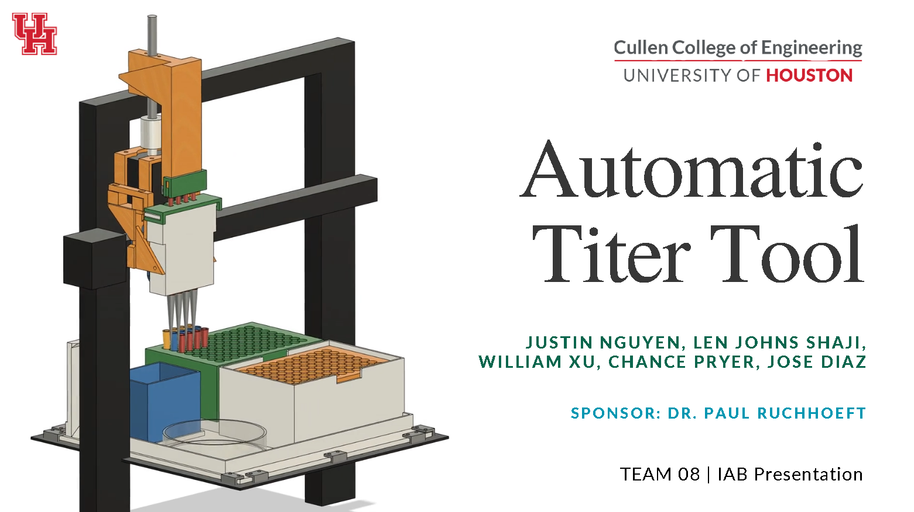

# Automatic-Titer-Tool
## Demo Video

- The main.py script is designed to control the Creality Ender 3 V2 3D Printer, specifically for the process of Automatic Titer.
- To 3D print the bed and other components, please refer to the 3D Model file.
- For a detailed overview of the entire project, you can view the slideshow at this link: https://www.canva.com/design/DAGkPGN6St4/lRYRx46TY_OqZiObvvhcrg/edit?utm_content=DAGkPGN6St4&utm_campaign=designshare&utm_medium=link2&utm_source=sharebutton
